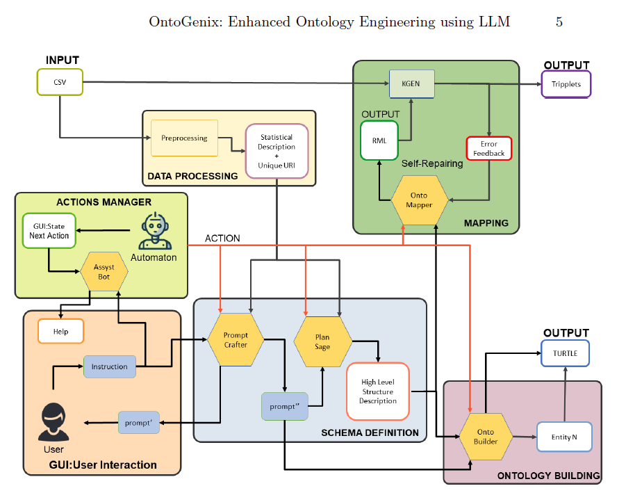
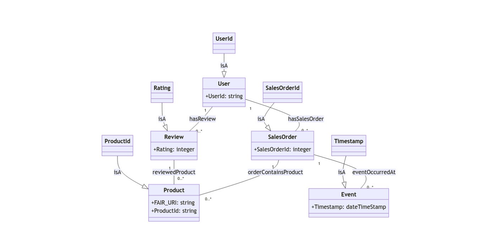

# Pasos:
A partir del siguiente diagrama, realizamos los pasos para generar una ontología a partir de unos datos dados:

## Paso 1. Carga el GUI
```{bash}
python -m GUI
```
## Paso 2. Indica el dataset a utilizar (?)
> e-commerce
## Paso 3. Carga el dataset a utilizar y lo muestra en la pestaña "CSV Inspector"
[LOAD CSV] > AmazonRatings.csv

```json
{
    "FAIR_URI": {
        "non_null_count": 20000.0,
        "type": "text",
        "unique_count": 20000.0,
        "count": null,
        "max": null,
        "mean": null,
        "min": null,
        "std": null
    },
    "ProductId": {
        "non_null_count": 20000.0,
        "type": "text",
        "unique_count": 1398.0,
        "count": null,
        "max": null,
        "mean": null,
        "min": null,
        "std": null
    },
    "Rating": {
        "non_null_count": 20000.0,
        "type": "categorical",
        "unique_count": 5.0,
        "count": 20000.0,
        "max": 5.0,
        "mean": 4.1719,
        "min": 1.0,
        "std": 1.3196732425
    },
    "UserId": {
        "non_null_count": 20000.0,
        "type": "text",
        "unique_count": 19101.0,
        "count": null,
        "max": null,
        "mean": null,
        "min": null,
        "std": null
    },
    "SalesOrderId": {
        "non_null_count": null,
        "type": "Numerical",
        "unique_count": null,
        "count": 20000.0,
        "max": 20000.0,
        "mean": 10000.5,
        "min": 1.0,
        "std": 5773.6470276594
    },
    "Timestamp": {
        "non_null_count": null,
        "type": "Numerical",
        "unique_count": null,
        "count": 20000.0,
        "max": 1406073600.0,
        "mean": 1335634513.92,
        "min": 908755200.0,
        "std": 78893658.41027519
    }
}
```
## Paso 4. Transforma los datos de entrada en una descripción de alto nivel y la muestra en la pestaña "Description"
> let's generate a high level structure definition for the provided data

```bash
**Foundational Prefix:**
`@prefix base: <https://base_ontology.com#> .`

**Data Description:**
1. FAIR_URI: text - A unique identifier for a resource - [Unique per resource]
2. ProductId: text - Identifier for a product - [1 to 1398]
3. Rating: categorical - User-provided rating for a product - [1 to 5]
4. UserId: text - Identifier for a user - [1 to 19101]
5. SalesOrderId: Numerical - Identifier for a sales order - [1 to 20000]
6. Timestamp: Numerical - Unix timestamp for an event - [908755200 to 1406073600]

**Classes:**
1. Product
2. User
3. SalesOrder
4. Review
5. Event

**Subclasses:**
1. ProductId: subclassof -> Product
2. UserId: subclassof -> User
3. SalesOrderId: subclassof -> SalesOrder
4. Rating: subclassof -> Review
5. Timestamp: subclassof -> Event

**Object Properties:**
1. hasReview: domain - User, range - Review
2. reviewedProduct: domain - Review, range - Product
3. hasSalesOrder: domain - User, range - SalesOrder
4. orderContainsProduct: domain - SalesOrder, range - Product
5. eventOccurredAt: domain - SalesOrder, range - Event

**Data Type Properties:**
1. hasFAIR_URI: domain - Product, range - xsd:string
2. hasProductId: domain - Product, range - xsd:string
3. hasRating: domain - Review, range - xsd:integer
4. hasUserId: domain - User, range - xsd:string
5. hasSalesOrderId: domain - SalesOrder, range - xsd:integer
6. hasTimestamp: domain - Event, range - xsd:dateTimeStamp

**Link of each entity to external resources:**
- FAIR_URI: owl:sameAs
- ProductId: schema:Product/sku
- Rating: schema:Rating/ratingValue
- UserId: schema:Person/identifier
- SalesOrderId: schema:Order/orderNumber
- Timestamp: schema:DateTime
```
## Paso 5. Define la ontología
> define the ontology

**NOTA:** La ontología definida es válida pero el prompt no está generando las comillas "```" para encerrar el turtle generado. Por ello, el siguiente paso a partir de este falla. De momento, hemos intentado colocar esas comillas a mano para generar el fichero `mermaid`.

**NOTA:** Hay que revisar el prompt para la acción "ontology_building", para que regenere las comillas automáticamente.

```turtle
@prefix base: <https://base_ontology.com#> .
@prefix owl: <http://www.w3.org/2002/07/owl#> .
@prefix rdf: <http://www.w3.org/1999/02/22-rdf-syntax-ns#> .
@prefix rdfs: <http://www.w3.org/2000/01/rdf-schema#> .
@prefix xsd: <http://www.w3.org/2001/XMLSchema#> .
@prefix schema: <http://schema.org/> .

base:Product rdf:type owl:Class .
base:User rdf:type owl:Class .
base:SalesOrder rdf:type owl:Class .
base:Review rdf:type owl:Class .
base:Event rdf:type owl:Class .

base:ProductId rdf:type owl:Class ;
    rdfs:subClassOf base:Product .
base:UserId rdf:type owl:Class ;
    rdfs:subClassOf base:User .
base:SalesOrderId rdf:type owl:Class ;
    rdfs:subClassOf base:SalesOrder .
base:Rating rdf:type owl:Class ;
    rdfs:subClassOf base:Review .
base:Timestamp rdf:type owl:Class ;
    rdfs:subClassOf base:Event .

base:hasReview rdf:type owl:ObjectProperty ;
    rdfs:domain base:User ;
    rdfs:range base:Review .
base:reviewedProduct rdf:type owl:ObjectProperty ;
    rdfs:domain base:Review ;
    rdfs:range base:Product .
base:hasSalesOrder rdf:type owl:ObjectProperty ;
    rdfs:domain base:User ;
    rdfs:range base:SalesOrder .
base:orderContainsProduct rdf:type owl:ObjectProperty ;
    rdfs:domain base:SalesOrder ;
    rdfs:range base:Product .
base:eventOccurredAt rdf:type owl:ObjectProperty ;
    rdfs:domain base:SalesOrder ;
    rdfs:range base:Event .

base:hasFAIR_URI rdf:type owl:DatatypeProperty ;
    rdfs:domain base:Product ;
    rdfs:range xsd:string .
base:hasProductId rdf:type owl:DatatypeProperty ;
    rdfs:domain base:Product ;
    rdfs:range xsd:string .
base:hasRating rdf:type owl:DatatypeProperty ;
    rdfs:domain base:Review ;
    rdfs:range xsd:integer .
base:hasUserId rdf:type owl:DatatypeProperty ;
    rdfs:domain base:User ;
    rdfs:range xsd:string .
base:hasSalesOrderId rdf:type owl:DatatypeProperty ;
    rdfs:domain base:SalesOrder ;
    rdfs:range xsd:integer .
base:hasTimestamp rdf:type owl:DatatypeProperty ;
    rdfs:domain base:Event ;
    rdfs:range xsd:dateTimeStamp .

base:FAIR_URI owl:sameAs schema:Product/sku .
base:ProductId owl:sameAs schema:Product/sku .
base:Rating owl:sameAs schema:Rating/ratingValue .
base:UserId owl:sameAs schema:Person/identifier .
base:SalesOrderId owl:sameAs schema:Order/orderNumber .
base:Timestamp owl:sameAs schema:DateTime .
```

## Paso 6. Generamos el diagrama mermaid haciendo click en el tab "mermaid" de la pestaña "Ontology". Esto generará el diagrama y se mostrará en la pestaña "Diagram".
Diagrama generado:

```mermaid
ProductId --|> Product : isA
UserId --|> User : isA
SalesOrderId --|> SalesOrder : isA
Rating --|> Review : isA
Timestamp --|> Event : isA
User "1" -- "0..*" Review : hasReview
Review "1" -- "0..*" Product : reviewedProduct
User "1" -- "0..*" SalesOrder : hasSalesOrder
SalesOrder "1" -- "0..*" Product : orderContainsProduct
SalesOrder "1" -- "0..*" Event : eventOccurredAt
```

A continuación, se muestra la imagen generada:


## Paso 7. Definimos el mapping (formato turtle). Esto generará el output en la pestaña "Mapping".
> define the mapping

**NOTA:** Igual que en el paso 5. Las comillas "`" faltan y se produce el siguiente error:

```bash
function arguments:  {'prompt': 'define the mapping'}
################# dataset_path ##############################
.\datasets/AmazonRating/AmazonRating_data20k_rml_mapping_LLM.csv.ttl
Error while writing the file: End marker not found in text.
------------------------- OUTPUT -------------------------
None
Error during function call: can only concatenate str (not "NoneType") to str
```

**NOTA:** Esto provoca que se produzca un error en el programa y no permite guardar el output. Además, no deja modificar el contenido de la pestaña "Mapping", por lo que tampoco se puede añadir de forma manual las comillas que faltan. Así que, intentamos corregir esto directamente desde el prompt de entrada de usuario:

> define the mapping. Don`t forget the three backticks at the beginning of the definition followed by the word "mermaid" and the three backticks at the end of the definition.

Intentando generar de nuevo el mapping con el prompt anterior no realiza ninguna mejora. Por lo que debemos modificar a mano el prompt utilizado por OntoGenix por debajo para corregir este fallo.