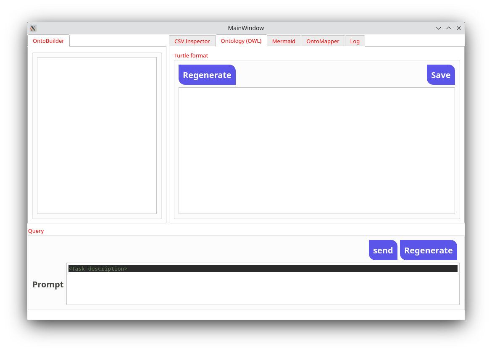

# OntoGenix

The project utilizes the OpenAI GPT-4 model to develop a semi-automatic system that generates OWL ontologies and RML mappings from CSV datasets using LLMs. 

**Important:**
Access to GPT-4 is required so you need to create an account and ask for acces to this model.

## GUI



## Installation

```bash
git clone repository_URL (not included due to anonymization)

cd Ontogenix

pip install -r requirements.txt

#Create a .env file inside GUI directory containing the openai api_key
touch ./GUI/.env
#write your openai api_key in .env file
OPENAI_API_KEY="your-api-key"
```

## Execution

```bash
python -m GUI
```


---

## GUI Instructions

Check out the video tutorial: OntoGenix.mp4

---

These are the main steps involved in the generation process of an ontology design withing OntoGenix. 

---

### **1. LOAD CSV**

- **Purpose**: This step focuses on importing the CSV dataset and subsequently producing a comprehensive statistical analysis of the dataset.

---

### **2. PROMPT CRAFTING**

- **Purpose**: A step towards the generation of the prompt that guides to the objective high level structure description of the ontology.

---
### **3. ONTOLOGY GENERATION**

- **Purpose**: The main objective here is to construct the ontology. This will be done through a sequence of structured sub-steps:

---

### **3.1. DESCRIPTION**

- **Purpose**: Two primary tasks will be carried out:
  - Provide a concise summary of the dataset using natural language.
  - Offer a high-level summary of the suggested ontology design architecture.

- **Options**:
  1. Allow the model to suggest a structure.
  2. Manually provide a prompt to specify the ontology's overarching structure.

---

### **3.2. ONTOLOGY**

- **Purpose**: This step is pivotal for creating the ontology's OWL definition, with a spotlight on classes and their associated object and data properties.
  
- **Note**: This process is automatic and doesn't require a prompt.

---

### **3.3. ONTOLOGY_ENTITY**

- **Purpose**: Tailored to formulating the ontology's OWL definition for specific entities.
  
- **Important**: A carefully crafted prompt that vividly describes the task is essential for this step.

---

#### **Examples for Crafting Prompts**:

**Example 1**: Improving a Class

**prompt:**  
Ensure you meticulously follow the guidelines laid out in the data description.
Explicitly reference all object and data properties linked to the entity in question.
Object property restrictions? Always use the "onClass" parameter.
Data type property restrictions? The "onDataRange" parameter is your go-to.
All the above-mentioned tasks should be executed for the entity: `{EntityName}`

---

**Example 2**: Enhancing Object/Data Type Properties

**prompt:**  
Enrich the entity with metadata and annotations to provide context, trace origin, and deliver deeper insights.
Retain the foundational name of the entity.
Include a descriptive field. Consider suggesting an alternative name and provide up to five alternative labels for enhanced clarity and versatility.
If there are any known equivalent properties in the ontology, be sure to define them. Steer clear of inventing fictional ones.
All these tasks are to be done for the entity: `{EntityName}`


---

### **4. MAPPING**

- **Purpose**: In this phase, a mapping is created by making use of the ontology in conjunction with the original CSV dataset.

- **Note**: This process is automatic and doesn't require a prompt.

---


## GUI Docs

For more information on the project's design, see the [Design Documentation](docs/design_documentation.md).

---

## Experimental evaluation

We have carried out an experiment comparing the ontologies generated by Ontogenix and the ones developed by humans. The results are available in the [OntoGenix Evaluation repository](https://github.com/tecnomod-um/OntoGenixEvaluation).