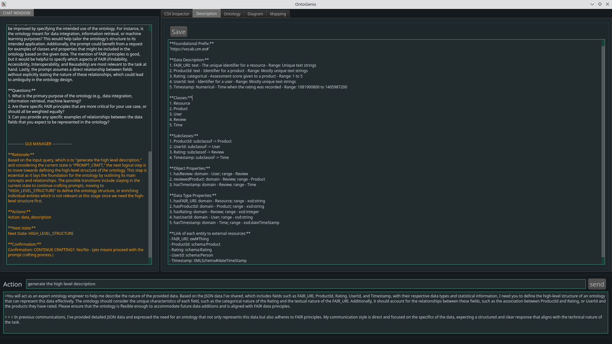

# OntoGenix

The project utilizes the OpenAI GPT-4 model to develop a semi-automatic system that generates OWL ontologies and RML mappings from CSV datasets using LLMs. 

**Important:**
Access to GPT-4 is required so you need to create an account and ask for acces to this model.

## GUI



## Installation

```bash
git clone https://github.com/mikelval82/OntoGenix.git

cd Ontogenix

pip install -r requirements.txt

#Create a .env file inside GUI directory containing the openai api_key
touch ./GUI/.env
#write your openai api_key in .env file
OPENAI_API_KEY="your-api-key"
```

## Execution

```bash
python -m GUI
```

## Experiment

We have carried out an experiment comparing the ontologies generated by Ontogenix and the ones developed by humans. These are the [results](./experiment/README.md).