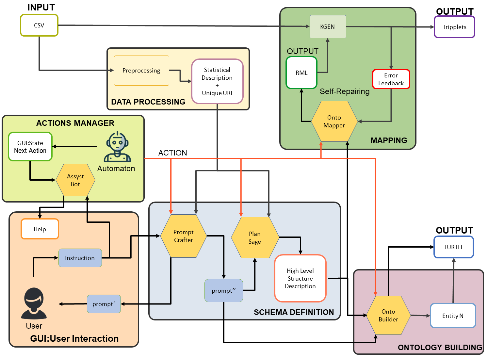

# GUI Software High Level Structure 

OntoGenix provides an elaborate workflow for enabling the generation of an ontology from a data file. In this section, we outline the methodology utilized by OntoGenix, emphasizing the discrete modules and how they interrelate. OntoGenix's architecture has been designed thoughtfully constructed to promote advanced ontology and data engineering by incorporating sophisticated Language Models, including GPT-4.  

The figure depicts the modular workflow from input to output, encompassing the key components such as data preprocessing, actions management, schema definition, ontology creation, mapping and data genereation. Central to the process is the integration of LLMs capabilities, enhancing the ontology engineering and data conversion processes. The system is designed for interactive user engagement, with mechanisms for error feedback and self-repairing mappings to ensure the accuracy and relevance of the ontologies and KGs generated.

This figure illustrates the OntoGenix pipeline for enhanced ontology engineering using LLMs. It details the flow from data input, through the various stages of  processing, actions management, schema definition, to the final output in ontology format. Key modules such as the Assist Bot, Prompt Crafter, Plan Sage, and OntoBuilder are shown, reflecting their roles in the ontology generation process. The diagram also emphasizes the system’s interactive nature with the GUI: User Interaction module and the feedback mechanisms integrated into the mapping and KG generation modules.

## Data Processing

The OntoGenix data preprocessing step is pivotal in ensuring the data is suitably structured and annotated for the effective generation of ontologies. These are the activities carried out in this step:

- Reading and initial processing of the dataset: The dataset is first read from a CSV file, ensuring that the encoding and memory considerations are appropriately handled.
- Unique Identifier Determination: The script identifies a unique identifier within the dataset, crucial for distinguishing individual records.
- Generation of Unique And Readable URIs: For each record, a Unique And Readable URI is generated, using a combination of selected column values and a hashed unique identifier. This step ensures that each record has a distinct and web-friendly identifier.
- Summarization of column data: The script categorizes and summarizes columns based on their data type – numerical, textual, or categorical – providing essential statistical insights into each type.
- Merging of summaries: The individual summaries are then merged to form a comprehensive overview of the dataset, highlighting the key characteristics of each column type.
- Cleaning and finalizing the summary: Any non-informative or placeholder entries are cleaned from the summary, ensuring clarity and relevance.
- Conversion to JSON Format: The summarized data is converted into a 'pretty' JSON format for ease of use and readability, which can be optionally saved to a file.

## Actions Management

The Actions Management module in OntoGenix serves as a crucial guide and facilitator for users, especially those new to ontology design, navigating the ontology construction process within the GUI framework.

The Assistive Bot plays a key role in providing tailored instructions to users. This agent is responsible for interpreting user prompts. It decides which of the other OntoGenix modules should receive a given prompt, making this decision based on both the current state of the ontology development process and the historical context of previous actions. The Assistive Bot ensures a smooth flow of the ontology construction process, and it intelligently performs the next action, directing user inputs to the appropriate modules at the right stages.

The Actions Management module is specifically designed to empower users with little to no previous experience in ontology design. It makes the complex process of designing ontologies more accessible and manageable. By providing contextual assistance and managing the flow of actions, the module significantly enhances the user experience, making the intricate task of ontology creation more user-friendly and intuitive.

## Schema Definition

The Schema Definition is a pivotal step in the OntoGenix pipeline, where the Prompt Crafter and Plan Sage modules play a significant role. These modules leverage the capabilities of advanced LLMs to assist in defining high-level structural descriptions for the ontology.

### The Prompt Crafter

The Prompt Crafter agent employs a sophisticated system prompt mechanism to facilitate the creation of ontologies. The process includes:

1. **Role Assignment:** ChatGPT is designated as an Expert Ontology Engineer.
2. **Objective:** Aid in developing ontology-structuring prompts from JSON data.
3. **Inputs:**
   - **Prompt:** Initial user-provided prompt.
   - **Data:** JSON data for ontology basis.
   - **Task:** Guidance for crafting an effective prompt.
4. **Refinement Process:**
   - **Sections:** Creation of prompt, critique, and clarifying questions.
   - **Iteration:** User feedback and ChatGPT adjustments until prompt finalization.
5. **User Perspective:** Ensure the prompt aligns with the user's intent.
6. **Inspiration:** Example line provided for reference.
7. **Engagement:** Creative and thoughtful approach in prompt development.

Next, the Prompt Crafter does an iterative refinement through which it engages in an iterative dialogue, refining and perfecting the prompt based on user feedback and additional information. This process ensures the prompt is precisely tailored to the user's requirements and the ontology's specific context.

### Plan Sage

The **Plan Sage** agent employs a comprehensive system prompt designed to analyze and synthesize JSON data for ontology development. This module begins with a prompt inviting the LLM (acting as an expert ontology engineer) to analyze a provided JSON dataset. The prompt includes:

1. Objective: Synthesize JSON data for ontology development.
2. Input Specification:
   - JSON Data: Input in JSON format.
   - Task Description: Defined task related to JSON data.
3. Data Analysis:
   - Critical Analysis: Perform a critical review of JSON data.
   - Synthesized Description: Produce a comprehensive summary of the data.
   - Column Relations: Detail potential relationships for ontology classification.
4. Structured Summary Components:
   - Prefix: Use "https://vocab.um.es#" for OWL types if no prefix is provided.
   - Data Description: Detail each JSON data column.
   - Classes and Subclasses: Enumerate and describe relationships.
   - Properties: List object and data type properties with domain and range.
   - External Links: Suggest connections to external ontological resources.
5. Restrictions: Exclude additional descriptions, introductions, explanations, and notes from the end of the document.

## Ontology Builder

The Onto Builder is responsible for defining classes, subclasses, properties, instances, and their relationships in Turtle format, ensuring the alignment of the content of the ontology with the conceptual model and the semantic content of the data. The Onto Builder agent uses two distinct system prompts to facilitate ontology creation and entity enrichment, namely, the ontology building prompt and the entity enrichment prompt, which are described next.

### Ontology Building Prompt

The agent starts with a prompt requesting the generation of an ontology in TURTLE syntax from provided JSON data and a schema description. The process includes:

1. **Objective:** Create a TURTLE syntax ontology from JSON data and schema.
2. **Input Details:**
   - **JSON Data:** The main source in JSON format.
   - **Data Description:** Context for the JSON data.
   - **Adherence:** Follow instructions precisely.
3. **Ontology Creation:**
   - **Completeness:** Ensure the TURTLE content is comprehensive.
   - **Structure Focus:** Prioritize logical ontology structure.
   - **Class Interconnection:** Connect all classes as per schema.
   - **Properties:** Define domain and range for each property.
   - **Omissions:** Exclude labels, comments, descriptions, instances.
4. **Writing Restrictions:**
   - **No Introductions:** Avoid introductions or explanations at the end.
   - **No Notes:** Do not include concluding notes.

### Entity Enrichment Prompt

The entity enrichment process involves analyzing a given ontology entity, data description, and insights behind the ontology's design. The steps include:

1. **Role:** ChatGPT as expert ontology engineer.
2. **Objective:** Enhance a specific ontology entity.
3. **Inputs:**
   - **Ontology:** The complete ontology.
   - **Data:** Data description for ontology.
   - **Insights:** Rationale for ontology design.
4. **Improvement Task:**
   - **Analysis:** Review ontology, data, and insights.
   - **Entity Focus:** Target improvements for an entity.
   - **Enhancements:** Suggest entity refinements.
5. **Output:**
   - **Syntax:** Present enhanced entity in TURTLE.
   - **Entity-Only:** Include only the entity's TURTLE content.
6. **Style and Restrictions:**
   - **Conciseness:** Exclude introductions, explanations, and notes.

## Mapping and Knowledge Graph Generation

The Mapping module in OntoGenix integrates the capabilities of KGEN (Knowledge Graph ENgine), RDF Mapping Language (RML), and self-repairing mechanisms. This combination allows for the efficient conversion of structured data into a knowledge graph, enhancing the accuracy of mappings through error feedback processes.

### Onto Mapper Module

The Onto Mapper agent employs two specific system prompts for RML generation and error correction. The process for mapping building prompt to generate RML mappings from an ontology and data rationale includes:

1. **Role:** ChatGPT as ontology translation specialist.
2. **Objective:** Generate RML mappings from an existing ontology.
3. **Inputs:**
   - **Rationale:** Explanation for the ontology's data source and structure.
4. **Output Guidelines:**
   - **URIs:** Construct unique URIs with 'FAIR_URI' and entity names.
   - **Prefixes:** Start RML with necessary prefixes, referencing them in triple blocks.
   - **Data Source:** Map from a CSV file, presented in Turtle syntax for clarity.
   - **URI Use:** Employ base prefix for URIs, not generic examples.
5. **Content Restrictions:**
   - **Completeness:** Provide full RML mapping definitions.
   - **Conciseness:** Exclude generic notes and focus exclusively on RML code.

For error correction, the Onto Mapper uses a self-repairing prompt:

1. **Task:** Produce RML mapping, rectifying a given error.
2. **Error Resolution:** Directly correct the identified error.
3. **Inputs:**
   - **Error:** Description of the mapping error.
   - **Rationale:** Background of the JSON data and ontology structure.
4. **Output Requirements:**
   - **URIs:** Create unique URIs with 'FAIR_URI' and entity names.
   - **Prefixes:** Include and reference necessary prefixes in RML.
   - **CSV Reference:** Use CSV, not JSON, in RML mappings.
   - **RML Class Mapping:** Adhere to the specified RML class mapping format.
   - **URI Usage:** Utilize base prefix for URIs.
5. **Style Guidelines:**
   - **RML Focus:** Deliver pure RML code, excluding explanations or notes.
   - **Precision:** Ensure complete and accurate mappings for each class.
   - **Prefix Attention:** Carefully include all RML prefixes.

The Knowledge Graph Generation Module (KGen) works in tandem with the Onto Mapper, executing commands to generate the knowledge graph. The process includes serializing the graph in N-Triples format and providing feedback on the generation process, including error tracing.

The RAG Onto Mapper orchestrates the overall mapping and KG generation process. It handles building the KGen with dataset paths and configuration, saving the RML mapping generated by Onto Mapper, and running the KGen to materialize the knowledge graph, capturing any errors.

The GUI behavior script initiates the mapping creation process, iteratively processing interactions with the Onto Mapper. It ensures the continuous refinement of the mapping based on error feedback and the completion of the KG generation once the mapping is error-free. In the final stages, OntoGenix allows for iterative refinement. The software actively engages domain experts and ontology engineers in a feedback loop to test the results and ensure its accuracy and applicability.
